# Trading Agent Documentation: Old vs New (NIFTY + BTC)

Last updated: April 25, 2026

## 1) Scope

This document compares:

- **Old plan**: `nifty agent master plan v3.pdf` (initial design intent)
- **Current implementation**: codebase state as of April 25, 2026

It also captures what was newly added after the original NIFTY-first plan, and includes architecture diagrams for both **NIFTY options agent** and **BTC futures agent**.

## 2) Source Notes and Assumptions

- The old master-plan PDF exists at `nifty agent master plan v3.pdf`.
- In this runtime, PDF text extraction tooling is unavailable (`pdftotext` and PDF Python libs are not installed), so "old plan" is reconstructed from:
  - module and script naming conventions (`Phase 4`, `Phase 5`),
  - existing NIFTY pipeline structure,
  - and the repository evolution visible in code and commits.

If needed, replace the inferred old-plan bullets below with exact PDF excerpts later.

## 3) Executive Summary

The project has evolved from a **NIFTY options ML + shadow-execution blueprint** into a **multi-agent trading platform** with:

- a productionized NIFTY pipeline (download -> feature build -> train -> shadow execution), and
- a significantly expanded BTC stack with tick-driven execution, regime routing, drift monitoring, HTF gates, and dedicated retraining workflow.

In short: the current system is broader, deeper, and more operationally mature than the original NIFTY-centric plan.

## 4) Old Plan vs Current System

### 4.1 Old Plan (Inferred from Master Plan v3)

Likely core goals in the original NIFTY document:

1. Build a NIFTY options agent using ML-derived directional and risk outputs.
2. Prepare historical data and engineered features (multi-timeframe + VIX context).
3. Train models for direction and execution parameters.
4. Run in shadow mode before any live deployment.
5. Track trade journal, daily summaries, and performance metrics.

### 4.2 Current System (Implemented)

Current code confirms:

1. **NIFTY Phase 4 training pipeline** is implemented (`scripts/train_model.py`, `core/model/train.py`).
2. **NIFTY feature + label pipeline** is implemented (`scripts/download_data.py`, `scripts/build_dataset.py`, `core/features/*`).
3. **NIFTY Phase 5 shadow engine** is implemented (`run_shadow.py`, `model_improver/*`).
4. **Research and weekly promotion flows** exist (`scripts/research_model.py`, `scripts/weekly_retrain.py`).
5. **BTC agent added as a major second system** (`btc_agent/*`, `run_train_btc.py`, `run_shadow_btc.py`).
6. **Operational controls** were expanded: capital tracking, open-position restore, reporting, daily/hourly heartbeats, richer logging, drift checks.

### 4.3 Comparison Table

| Area | Old Plan (v3, inferred) | Current Implementation |
|---|---|---|
| Instrument scope | Primarily NIFTY options | NIFTY + SENSEX support in config; full BTCUSDT stack added |
| Data ingestion | Historical index + context | Fyers historical for NIFTY/VIX; Binance + Delta sync for BTC |
| Feature engineering | Multi-timeframe technical features | Expanded MTF features, option premium proxies, regime/context features, HTF merges (BTC) |
| Modeling | Directional classifier and trade-parameter targets | Multi-model NIFTY target heads + BTC LightGBM model with threshold and regime variants |
| Validation | Walk-forward/backtest intent | Walk-forward metrics persisted; research candidate runner; threshold/promotion workflows |
| Execution mode | Shadow first | NIFTY shadow engine + BTC 24/7 tick-driven shadow engine |
| Risk management | Basic SL/target/trailing intent | Capital reservation, margin-aware sizing, fee viability checks, max concurrent positions |
| Observability | Journal and reporting intent | Telegram reporting, detailed logging, heartbeat summaries, drift alerts |
| Lifecycle ops | Train and deploy concept | Weekly retrain + promotion logic + research comparisons + artifact versioning metadata |

## 5) What Was Added Beyond the Old Docs

The following are meaningful additions that appear to be post-plan evolution:

1. **Full BTC subsystem**
   - Dedicated BTC data, features, labeler, trainer, signal handler, engine, reporter, journal.
   - Separate shadow runtime: `run_shadow_btc.py`.

2. **Tick-driven real-time execution (BTC)**
   - WebSocket tick loop with immediate SL/TP checks.
   - Candle-boundary signal polling for entries.
   - Async worker and render loops for stable 24/7 operations.

3. **Regime-aware model routing (BTC)**
   - Regime classification and optional regime-specific model artifacts.

4. **Drift monitoring (BTC)**
   - `drift_monitor.py` integration in signal pipeline.

5. **HTF structure gating (BTC)**
   - 15m/45m/1h context merges and trend filters used in training/inference.

6. **Model research and promotion workflows (NIFTY)**
   - Multi-candidate research runner.
   - Weekly retrain with promotion threshold gate (`--promote`).

7. **Production-grade journaling/capital controls**
   - Open-trade restoration on restart.
   - Capital reserve/release and net PnL accounting with charges.

8. **Cross-instrument config hardening**
   - Instrument metadata (lot sizes, tick size, weekly expiry behavior, exchange mapping).

## 6) NIFTY Agent Architecture

```mermaid
flowchart LR
    A["Fyers API (Index + VIX + Option Chain)"] --> B["scripts/download_data.py\nRaw parquet in data/nifty/raw"]
    B --> C["scripts/build_dataset.py"]
    C --> D["core/features/engineering.py\nCandlestick + Regime + VIX + Option Features"]
    D --> E["core/features/labels.py\n(direction/sl_bin/trail_bin/trail_tf/phase1_target)"]
    E --> F["Dataset: data/nifty/datasets/NIFTY_features.parquet"]

    F --> G["scripts/train_model.py\ncore/model/train.py"]
    G --> H["Artifacts: core/model/artifacts/NIFTY_*.joblib + metrics json"]

    H --> I["run_shadow.py\nmodel_improver/engine.py"]
    I --> J["core/model/predict.py\nNiftyPredictor"]
    J --> K["model_improver/signal_handler.py\nRR/confidence/VIX gates + strike selection"]
    K --> L["model_improver/shadow_mode.py\nEntry/SL/Target/Trailing"]
    L --> M["model_improver/journal.py + db.py\nTrade logs"]
    L --> N["core/risk/capital_tracker.py\nCapital reserve/release"]
    L --> O["model_improver/reporter.py\nTelegram + daily summary"]
```

## 7) BTC Agent Architecture

```mermaid
flowchart LR
    A["Binance historical + Delta sync"] --> B["run_train_btc.py\nStep 1-2 data collection"]
    B --> C["btc_agent/features.py\nBuild per-TF features"]
    C --> D["HTF merge (15m/45m/1h into 1m)"]
    D --> E["btc_agent/labeler.py\nSignal/label generation"]
    E --> F["btc_agent/train.py\nEMA pair search + model training"]
    F --> G["Artifacts: data/btc/models/*.pkl + model_meta.json"]

    G --> H["run_shadow_btc.py\nBtcEngine"]
    H --> I["delta_client WebSocket ticks + REST OHLCV fallback"]
    I --> J["btc_agent/btc_engine.py\nTick-driven SL/TP + candle-boundary poll"]
    J --> K["btc_agent/btc_signal_handler.py\nConfluence/regime/drift/fee/risk gates"]
    K --> L["btc_agent/btc_shadow_mode.py\nPosition simulation"]
    L --> M["btc_agent/btc_journal.py\nTrade persistence"]
    L --> N["core/risk/capital_tracker.py\nCapital accounting"]
    L --> O["btc_agent/btc_reporter.py\nAlerts + summaries"]
```

## 8) Key Documentation Drift to Track

These are the most important gaps where old docs are likely outdated:

1. **System boundary changed**: now dual-agent (NIFTY + BTC), not NIFTY-only.
2. **Execution semantics changed**: BTC is tick-driven 24/7; NIFTY is market-window polling.
3. **Model governance improved**: research candidates, promotion gating, richer metrics.
4. **Risk logic evolved**: fee viability, leverage cap, concurrency limits, drift checks.
5. **Operational reliability improved**: restart-safe open-trade restore and stronger observability.

## 9) Recommended Next Documentation Files

To keep docs maintainable, split this into:

1. `docs/nifty_agent.md` (NIFTY-only runbook + architecture)
2. `docs/btc_agent.md` (BTC-only runbook + architecture)
3. `docs/model_lifecycle.md` (training, promotion, rollback, artifact contracts)
4. `docs/ops_runbook.md` (alerts, restart, incident handling, logs)

---

If you want, next iteration can include an **exact PDF-to-code traceability matrix** once the PDF text is extracted locally.
