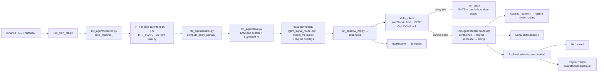

# BTC Agent — Runbook & Architecture

Last updated: April 25, 2026

---

## 1. Purpose

24/7 BTCUSDT futures shadow agent built on a tick-driven LightGBM stack.  
Core design choices:

- **Entry decisions at candle boundaries** (1m close) — avoids intra-candle noise.
- **SL/TP checks on every WebSocket tick** — no 1-second polling lag on exits.
- **Regime-aware model routing** — routes inference to one of four regime-specific models when available, falls back to the base model.
- **Structural confluence gate before model inference** — `long_signal XOR short_signal` must fire; no SMC structure = no inference.
- **Feature drift monitoring** — per-feature z-score vs training distribution; alerts when |z| > 4.0.

---

## 2. Key Paths

| Role | Path |
|---|---|
| Raw candle data | `data/btc/raw/` |
| Processed features / labels | `data/btc/processed/` |
| Model artifacts | `data/btc/models/` |
| Capital state | `data/btc/capital.parquet` |
| Trade journal | `data/btc/btc_journal.parquet` |
| Training entrypoint | `run_train_btc.py` |
| Runtime entrypoint | `run_shadow_btc.py` |
| Engine | `btc_agent/btc_engine.py` |
| Signal handler | `btc_agent/btc_signal_handler.py` |
| Drift monitor | `btc_agent/drift_monitor.py` |
| Regime classifier | `btc_agent/regime_classifier.py` |

---

## 3. Environment Variables

| Variable | Required | Default | Purpose |
|---|---|---|---|
| `TELEGRAM_BOT_TOKEN` | No | — | Telegram alerting |
| `TELEGRAM_CHAT_ID` | No | — | Telegram alerting |
| `BTC_USD_INR` | No | `85.0` | USD→INR conversion for sizing and reporting |
| `BTC_CLOSE_ON_SHUTDOWN` | No | `false` | Force-close all open positions on `Ctrl+C` |

If Telegram creds are absent, the reporter logs a warning and the engine continues running.

---

## 4. Training Runbook

```bash
cd /Users/aditya/Desktop/chartflix/trading_agent

# Full pipeline: download → features → labels → train
./.venv/bin/python run_train_btc.py

# Reuse raw data, rebuild features + labels + retrain
./.venv/bin/python run_train_btc.py --skip-download

# Reuse raw + features, only relabel + retrain
./.venv/bin/python run_train_btc.py --skip-features
```

Training writes:

| File | Purpose |
|---|---|
| `data/btc/models/lgbm_signal_model.pkl` | Base LightGBM model (all regimes) |
| `data/btc/models/model_meta.json` | Feature column list, EMA params, threshold, feature stats for drift |
| `data/btc/models/lgbm_signal_model_bull_normal.pkl` | Optional regime overlay |
| `data/btc/models/lgbm_signal_model_bull_high_vol.pkl` | Optional regime overlay |
| `data/btc/models/lgbm_signal_model_bear_normal.pkl` | Optional regime overlay |
| `data/btc/models/lgbm_signal_model_bear_high_vol.pkl` | Optional regime overlay |

`model_meta.json` carries:

- `feature_cols` — ordered list consumed by inference
- `ema_fast` / `ema_slow` — EMA pair used in labeling (e.g. 8/21)
- `best_threshold` — confidence threshold from threshold-search; overrides the hardcoded `MIN_CONFIDENCE=0.55`
- `reverse_map` — label-index remapping for binary classification
- `feature_stats` — per-feature `{mean, std}` used by `DriftMonitor`

---

## 5. Shadow Runtime

```bash
cd /Users/aditya/Desktop/chartflix/trading_agent
./.venv/bin/python run_shadow_btc.py --capital 20000 --model-version v1.0
```

**`--capital`** is the starting paper capital in INR.  
**`--model-version`** is a label string attached to journal rows for audit.

---

## 6. Signal Gate Pipeline

Every candle boundary triggers `BtcSignalHandler.process()`. Gates fire in order; the first failure short-circuits with a rejection reason logged to `last_rejection_reason`.

```
1. INVALID_INPUT          — price or capital <= 0
2. NO_DIRECTIONAL_CONFLUENCE — long_signal == short_signal (no SMC setup fired)
3. MAX_CONCURRENT         — open_trades >= max_concurrent (default 1)
4. RSI_OVERBOUGHT / RSI_OVERSOLD — HTF RSI (45m → 15m → 1m fallback) > 80 long, < 20 short
5. Model inference        — regime-routed LightGBM.predict_proba()
6. CONFIDENCE_LOW         — win_probability < MIN_CONFIDENCE (trend) or < 0.60 (reversal)
7. ATR_MISSING / ATR_INVALID — 15m ATR (fallback 1m ATR) must be > 0
8. NO_STRUCTURE_CONFLUENCE — OB and/or FVG flags determine SL/TP multipliers; neither = reject
9. FEE_UNVIABLE           — TP move < (ROUND_TRIP_FEE / MAX_FEE_PCT_OF_TP) = ~0.39% of price
10. SIZE_INVALID           — computed contracts rounds to 0
→ SIGNAL_READY            — all gates pass, BtcTradeSignal emitted
```

### SL/TP multiplier table (ATR-based)

| Setup type | OB | FVG | SL mult | TP mult |
|---|---|---|---|---|
| Reversal | ✓ | ✓ | 1.0× | 4.0× |
| Trend | ✓ | ✓ | 1.2× | 3.5× |
| Trend | ✓ or ✓ (not both) | ✓ or ✓ (not both) | 1.5× | 3.0× |
| Any | ✗ | ✗ | reject | — |

Base ATR source: 15m ATR-14. Falls back to 1m ATR-14 if 15m is missing.

### Position sizing

```
risk_usd  = capital_usd × RISK_PCT × confidence_scale × reversal_mult
contracts = risk_usd / sl_dist_usd  (rounded down to 0.001 BTC)
contracts = min(contracts, (capital_usd × MAX_LEVERAGE) / price)
```

| Constant | Value |
|---|---|
| `RISK_PCT` | 1% of capital per trade |
| `MAX_LEVERAGE` | 10× |
| `MIN_CONFIDENCE` (trend) | 0.55 (or `best_threshold` from meta) |
| `MIN_CONFIDENCE` (reversal) | 0.60 |
| `REVERSAL_SIZE_MULT` | 0.50 |
| `MAX_CONCURRENT_POSITIONS` | 1 |
| Round-trip fee | 0.118% (taker + taker + 18% GST) |

---

## 7. Regime Classification

Four regimes based on two independent signals:

| Signal | Rule |
|---|---|
| Trend | `close > SMA-200` → `bull`, else `bear` |
| Volatility | `ATR-14 rolling-20 mean > 1.5 × ATR-14 rolling-200 mean` → `high_vol`, else `normal` |

Resulting regimes: `bull_normal`, `bull_high_vol`, `bear_normal`, `bear_high_vol`.  
If `sma_200` or `close` is NaN, regime is `unknown` and the base model is used.

---

## 8. Drift Monitor

`DriftMonitor.check(row)` compares each feature in `feature_stats` against the training distribution:

```
z = |( value - mean ) / std|
alert when z > 4.0
```

Alerts are collected into `BtcSignalHandler.last_drift_alerts` (list of `"feature(z=X.X)"`).  
They are informational — they do not block trade entry but are logged.

---

## 9. Threading Model

```
Main thread          — housekeeping loop: hourly heartbeat, daily summary (1s sleep)
btc-render thread    — terminal live-ticker at 200ms interval
WebSocket thread     — calls _on_tick() on every trade tick
btc-tick-work thread — spawned per tick batch; owns SL/TP checks + candle-boundary poll
```

Locks:
- `_display_lock` — guards `_latest_display_price / _latest_display_time`
- `_tick_work_lock` — serializes tick-work dispatch; coalesces pending ticks (max/min of H/L)
- `_poll_lock` — prevents re-entrant `_poll()` if previous candle poll is still running

---

## 10. Architecture



---

## 11. Operational Notes

- The engine runs continuously (24/7) — there is no market-window gate.
- Entry decisions fire at each 1m candle boundary regardless of time of day.
- On restart, `BtcShadowMode` restores open trades from `btc_journal.parquet` — capital is not double-counted.
- `BTC_CLOSE_ON_SHUTDOWN=true` forces all open trades closed before exit; default is to leave them open for restoration on next start.
- REST OHLCV is always used for 1m candles (tick-aggregated 1m bars drop quiet-period candles, shifting RSI/MACD vs exchange values). HTF candles use tick-built bars once warm, falling back to REST.
