# NIFTY Agent — Runbook & Architecture

Last updated: April 25, 2026

---

## 1. Purpose

NIFTY (and SENSEX) options shadow-trading agent built on a multi-timeframe ML stack:

- Predicts trade direction and execution parameters (SL bucket, trail bucket, trail timeframe, phase-1 target).
- Converts predictions into option strike selections via live option-chain lookups.
- Executes only in shadow / paper mode — no real orders.
- Journals all trades and sends Telegram alerts (entries, exits, hourly heartbeat, daily summary).

The engine polls every 5-minute mark during Indian market hours.  
All times are IST; the engine does not run outside market windows.

---

## 2. Key Paths

| Role | Path |
|---|---|
| Raw candle data | `data/nifty/raw/` |
| Feature + label dataset | `data/nifty/datasets/NIFTY_features.parquet` |
| Model artifacts | `core/model/artifacts/NIFTY_*` |
| Research candidates | `core/model/artifacts/research/` |
| Capital state | `model_improver/data/capital.parquet` |
| Trade journal (parquet) | `model_improver/data/trades.parquet` |
| Runtime entrypoint | `run_shadow.py` |
| Engine | `model_improver/engine.py` |
| Signal handler | `model_improver/signal_handler.py` |
| Shadow executor | `model_improver/shadow_mode.py` |
| Reporter | `model_improver/reporter.py` |

---

## 3. Environment Variables

Configured via `.env` (see `.env.template` for all keys):

| Variable | Purpose |
|---|---|
| `FYERS_CLIENT_ID` | Fyers API auth |
| `FYERS_SECRET_KEY` | Fyers API auth |
| `FYERS_REDIRECT_URI` | OAuth redirect |
| `FYERS_ID` | Auto-login credential |
| `FYERS_PIN` | Auto-login credential |
| `FYERS_TOTP_SECRET` | TOTP for auto-login |
| `TELEGRAM_BOT_TOKEN` | Telegram alerting |
| `TELEGRAM_CHAT_ID` | Telegram alerting |
| `MODEL_VERSION` | Optional label for journal rows |

---

## 4. Training Runbook

```bash
cd /Users/aditya/Desktop/chartflix/trading_agent
export PYTHONPATH=.

# Step 1: Download raw candles (adjust date window as needed)
./.venv/bin/python scripts/download_data.py --start 2026-04-21 --end 2026-04-25

# Step 2: Build feature + label parquet
./.venv/bin/python scripts/build_dataset.py \
  --instrument NIFTY \
  --output /Users/aditya/Desktop/chartflix/trading_agent/data/nifty/datasets/NIFTY_features.parquet

# Step 3: Train all model heads
./.venv/bin/python scripts/train_model.py \
  --instrument NIFTY \
  --dataset /Users/aditya/Desktop/chartflix/trading_agent/data/nifty/datasets/NIFTY_features.parquet \
  --output /Users/aditya/Desktop/chartflix/trading_agent/core/model/artifacts
```

---

## 5. Feature Engineering

`FeatureEngineer` builds four per-timeframe frames then merges them via `merge_asof` onto the 5m spine:

| Frame | Key indicators |
|---|---|
| 5m | EMA, RSI-14, ATR-14, z-score, realized vol |
| 15m | Same + merged as HTF context |
| 60m | Regime detection (ADX, pivot H/L) |
| Daily | VIX features, weekly expiry context |

Additional feature modules:

- `core/features/option_features.py` — option premium proxies, days-to-expiry
- `core/features/pattern_context.py` — consecutive streak, session-open reference
- `core/features/regime.py` — `RegimeDetector` using manual ADX + pivot high/low
- `core/features/vix_features.py` — VIX level, VIX z-score, VIX regime bucket

Label columns built by `core/features/labels.py`:

| Column | Type | Meaning |
|---|---|---|
| `direction` | binary | 1 = bullish, 0 = bearish |
| `sl_bin` | multiclass | stop-loss distance bucket |
| `trail_bin` | multiclass | trailing stop bucket |
| `trail_tf` | multiclass | trailing timeframe |
| `phase1_target` | continuous | ATR-based first-target in index points |
| `adverse_excursion` | continuous | max adverse move during trade window |
| `favorable_excursion` | continuous | max favorable move during trade window |

---

## 6. Model Architecture

`NiftyTrainer` trains separate pipelines for each target:

| Head | Pipeline type | Algorithm |
|---|---|---|
| `direction` | Classifier | XGBoost (with SHAP feature selection) |
| `sl_bin` | Multiclass classifier | XGBoost + LabelEncoder |
| `trail_bin` | Multiclass classifier | XGBoost + LabelEncoder |
| `trail_tf` | Multiclass classifier | XGBoost + LabelEncoder |
| `phase1_target` | Regressor | XGBoost |

All pipelines include `SimpleImputer` for NaN handling.

Walk-forward validation runs N folds; each fold reports `direction_accuracy` and `direction_f1`.  
Aggregate metrics (`mean_f1`, `std_f1`) are persisted in `NIFTY_train_metrics.json`.

---

## 7. Research & Weekly Retrain

```bash
cd /Users/aditya/Desktop/chartflix/trading_agent
export PYTHONPATH=.

# Multi-candidate research run (hyperparameter variants)
./.venv/bin/python scripts/research_model.py \
  --instrument NIFTY \
  --dataset /Users/aditya/Desktop/chartflix/trading_agent/data/nifty/datasets/NIFTY_features.parquet \
  --output /Users/aditya/Desktop/chartflix/trading_agent/core/model/artifacts/research

# Weekly retrain with promotion gate
./.venv/bin/python scripts/weekly_retrain.py \
  --instrument NIFTY \
  --dataset /Users/aditya/Desktop/chartflix/trading_agent/data/nifty/datasets/NIFTY_features.parquet \
  --output /Users/aditya/Desktop/chartflix/trading_agent/core/model/artifacts \
  --promote
```

Promotion gate in `weekly_retrain.py`: new artifacts are copied to the production artifact directory only if the new model's weighted F1 exceeds the previous F1 by **> 0.005**.  
If the gate fails, the new artifacts are discarded and the existing model is left untouched.

---

## 8. Signal Gate Pipeline

`SignalHandler.process()` applies gates in order:

```
1. VIX > 30        → None (macro risk block)
2. confidence < MIN_CONFIDENCE (0.60) → None
3. ATR <= 0        → None (data quality block)
4. LOT_SIZE invalid → None
5. SL distance from sl_bin → must be > 0
6. phase1_target   → must be > 0
7. RR = target / sl < MIN_RR (1.5) → None
8. option_chain_service.get_best_instrument() → must return a valid chain
9. strike_selector.select() → must return a valid strike
10. entry_premium <= 0 or strike == 0 or expiry is None → None
→ TradeSignal emitted
```

`TradeSignal` fields: `instrument`, `direction`, `option_type` (CE/PE), `strike`, `expiry_date`, `entry_premium`, `sl_price`, `target_price`, `trail_bin`, `trail_tf`, `confidence`, `direction_prob`, `vix`, `atr`, `lot_size`.

---

## 9. Shadow Runtime

```bash
cd /Users/aditya/Desktop/chartflix/trading_agent
./.venv/bin/python run_shadow.py --instrument NIFTY --log-level INFO
```

Engine polling cadence: aligns to the next 5-minute mark, then sleeps until the subsequent one.  
Scheduled tasks (end-of-day close, daily summary, hourly heartbeat) are handled inside `Engine._handle_schedule_tasks()`.

---

## 10. Architecture

```mermaid
flowchart LR
    A["Fyers API\nIndex + VIX + Option Chain"] --> B["scripts/download_data.py\ndata/nifty/raw/"]
    B --> C["scripts/build_dataset.py"]
    C --> D["core/features/engineering.py\nFeatureEngineer: 5m/15m/60m/daily merge"]
    D --> E["core/features/option_features.py\ncore/features/pattern_context.py\ncore/features/vix_features.py\ncore/features/regime.py"]
    E --> F["core/features/labels.py\nbuild_labels(): 7 target columns"]
    F --> G["data/nifty/datasets/NIFTY_features.parquet"]

    G --> H["scripts/train_model.py\nNiftyTrainer: walk-forward + SHAP selection"]
    H --> I["core/model/artifacts/\nNIFTY_direction.joblib + 8 more files\n+ NIFTY_train_metrics.json"]

    I --> J["run_shadow.py → Engine"]
    J --> K["core/model/predict.py\nNiftyPredictor.predict()"]
    K --> L["model_improver/signal_handler.py\nVIX/confidence/RR/chain gates"]
    L --> M["model_improver/shadow_mode.py\nShadowMode.enter_trade()"]
    M --> N["model_improver/journal.py\nJournal: parquet + SQLite"]
    M --> O["core/risk/capital_tracker.py\nCapitalTracker"]
    J --> P["model_improver/reporter.py\nReporter → Telegram"]
```



---

## 11. Operational Notes

- Engine runs only during Indian market hours; `Engine._market_open()` calls `is_trading_day()` from `core/utils/market_calendar.py`.
- On restart, `ShadowMode._restore_open_trades()` reloads open positions from journal; capital is not double-counted.
- Artifacts are per-instrument. `SENSEX_*` artifacts are supported with the same pipeline using `--instrument SENSEX`.
- Fyers auth auto-login uses TOTP (`FYERS_TOTP_SECRET`) — ensure the system clock is accurate.
- Option premium lookups (`_latest_option_price_fallback`) and LTP checks are cached in-engine to reduce Fyers API calls.
